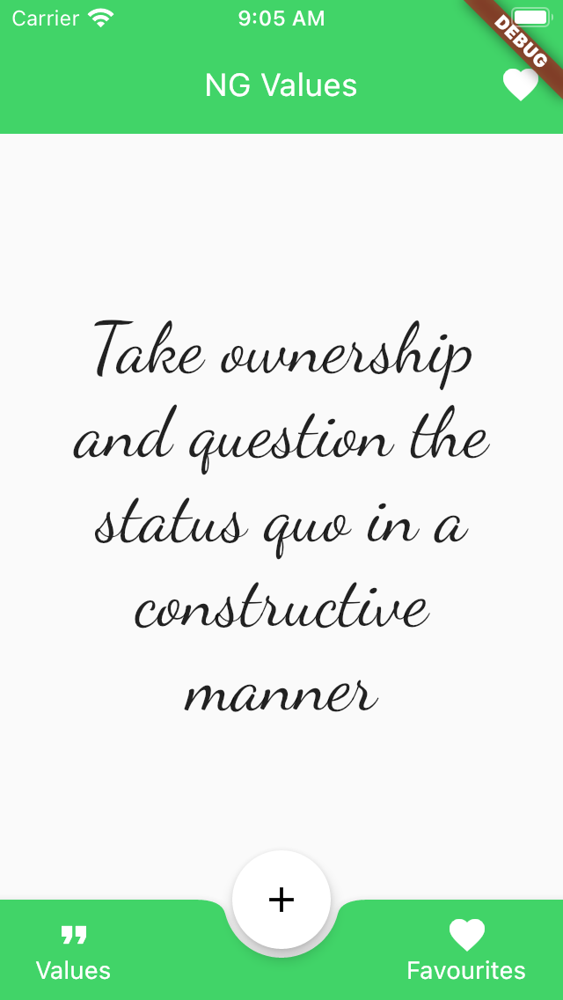
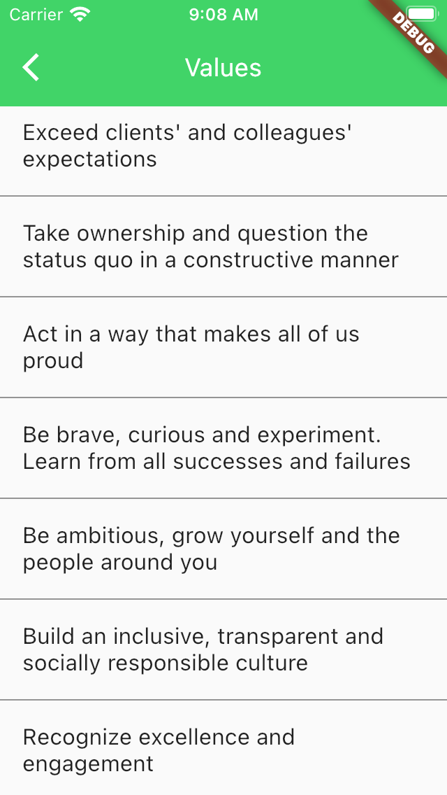
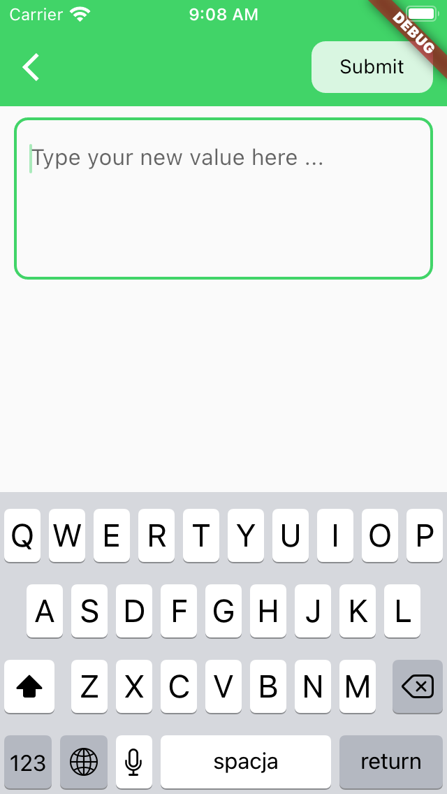

# Values Generator

App that shows a random value on the screen.

Features:
- support for preloading values from json
- creating, storing and deleting values in app
- saving values to favourites
- displaying values and favourites in lists
- light and dark theme dependent on system settings

---
## Documentation

- [Startup](#startup)
- [Requirements](#requirements)
- [Tests](#tests)
- [Generate Values](#generate-values)
- [Screens](#screens)

## Requirements

- Flutter 1.22.2
- Xcode

## Startup

To start a project first you need to get the dependencies. Go to your main folder and write following command in your terminal.

```bash
flutter pub get
```

After that you can run this app.

This project supports build variants. To use one of them simply write:
- for development:

```bash
flutter run -t lib/main_dev.dart
```

- for production

```bash
flutter run -t lib/main.dart
```

If you are using Visual Studio Code, there is a file that conveniently handles them for you.

## Tests

To run the test please write following command in main folder

```bash
flutter test
```

## Generate Values

### Classes

To regenerate injectable and freezed classes write: 

```bash
flutter pub pub run build_runner build 
```

### Translations

To regernerate translations use:

```bash
flutter pub run easy_localization:generate --source-dir ./assets/translations 
```

and then:

```bash
flutter pub run easy_localization:generate --source-dir ./assets/translations -f keys -o locale_keys.g.dart
```

## Screens



